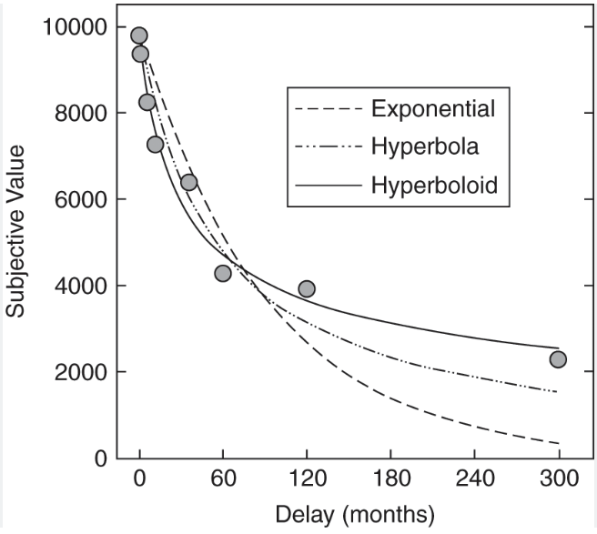
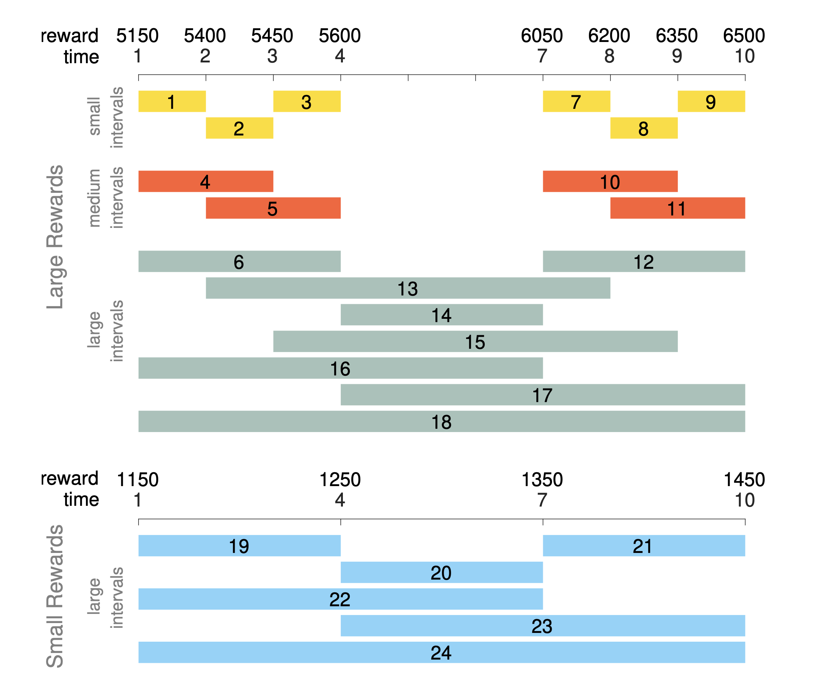
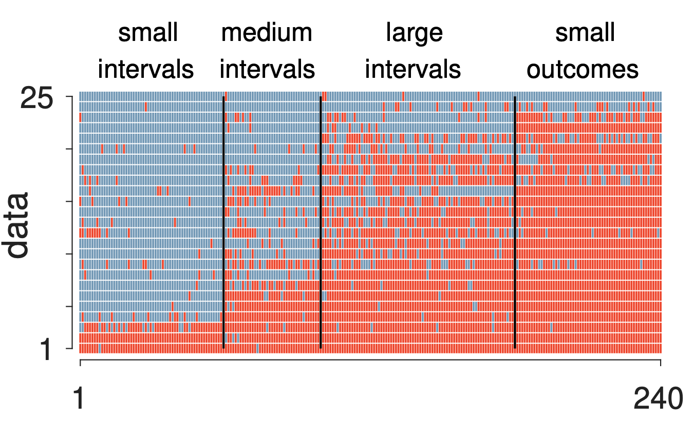
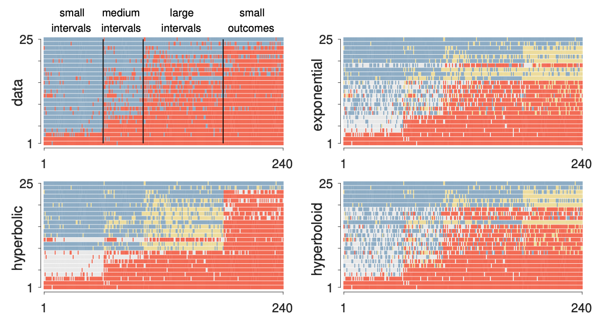
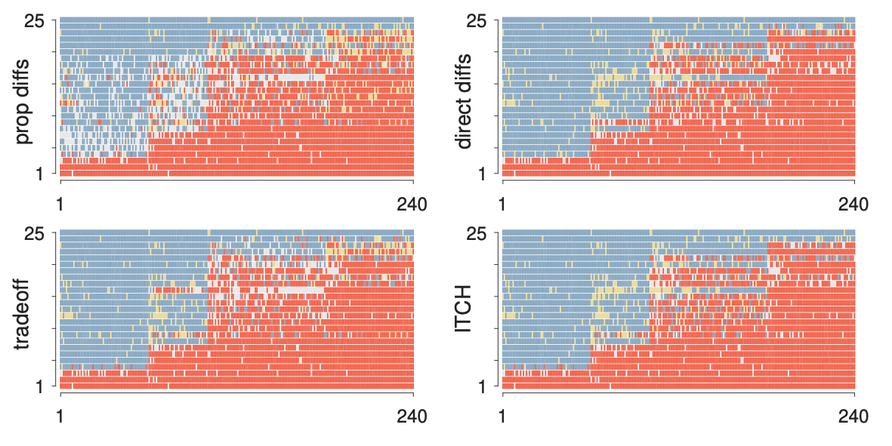
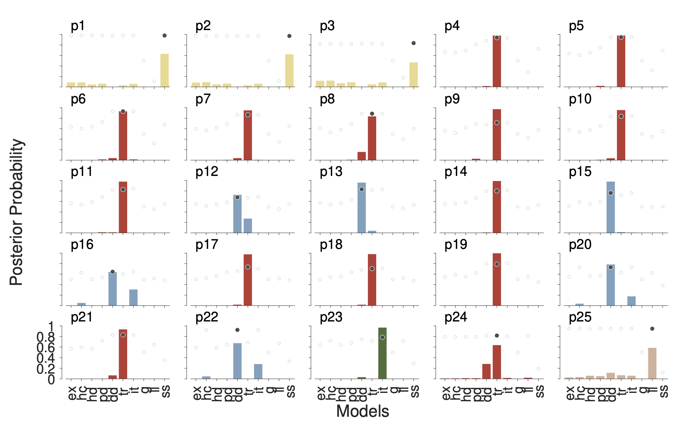
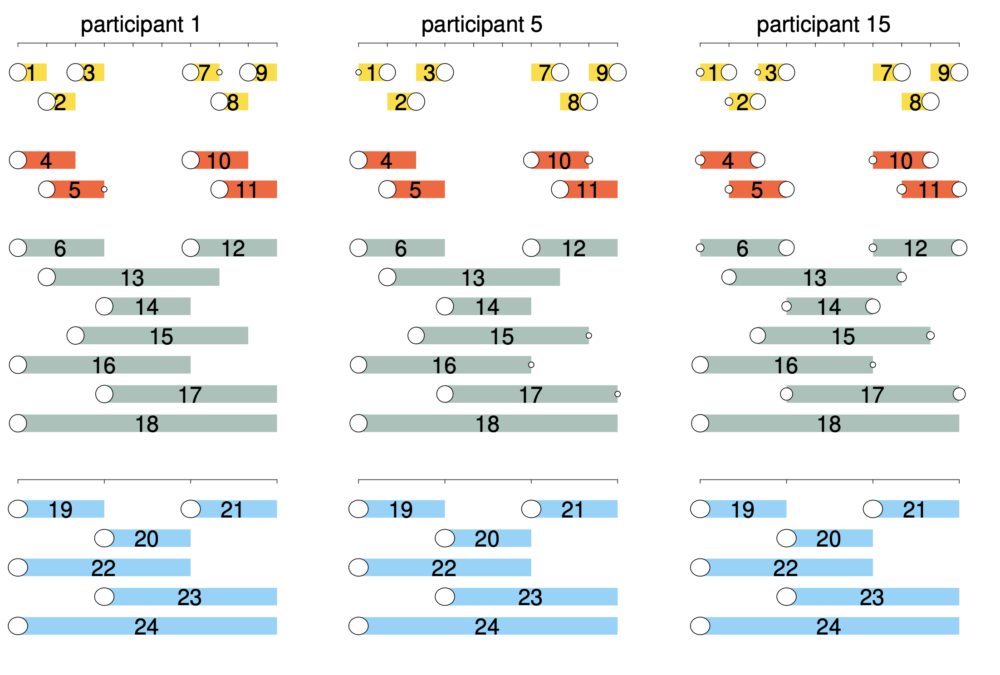

### Proyecto en colaboración

:::: {.columns}
::: {.column style="width:17%; font-size: 0.8em; height:10%"}

Arturo Bouzas

- Lab25
- Facultad de Psicología
- UNAM
- [https://www.bouzaslab25.com](https://www.bouzaslab25.com/)

:::
::: {.column width="30%"}
<!-- empty column to create gap -->
:::

::: {.column style="width:20%; font-size: 0.8em; height:10%"}

Michael D. Lee

- Department of Cognitive Sciences
- School of Social Sciences
- University of California, Irvine
- [https://faculty.sites.uci.edu/mdlee/lab/](https://faculty.sites.uci.edu/mdlee/lab/)

:::
::::

# Elección intertemporal {background-color="#fdede8"}

## Elección intertemporal

- ¿Cómo elegimos entre cosas que están en el tiempo?

:::: {.columns}
::: {.column style="width:33%; font-size: 0.6em;"}

:::
::: {.column width="20%"}

:::
::: {.column style="width:33%; font-size: 0.6em;"}

:::
::::

:::{.notes}
- Gastar inmediatamente o ahorrarlo para el retiro
- Despertarse con la alarma para comenzar a tiempo el día o desplazarla para seguir durmiendo
- Hacer ejecicio o mantener una vida sedentaria
- Si un niño elige un bombón ahorita o tres después [@Shoda1990; @Watts2018]
:::

- En estos escenarios podemos hacer una distinción entre:

    - Satisfacción inmediata
    - Satisfacción a futuro

## ¿Por qué es importante?

Muchas decisiones que afectan la calidad de vida de las personas son dilemas de
elección intertemporal, con implicaciones directas para el diseño de políticas públicas.

- La preferencia por recompensas inmediatas se ha asociado con consumo de tabaco [@Bickel1999], consumo de alcohol [@Petry2001], consumo de heroína [@Kirby1999]
- El sesgo al presente lleva a **ahorro insuficiente para el retiro** [@Beshears2022]
- Y a **consumo excesivo** en el corto plazo [@Calcott2022]

## Tareas que se utilizan para estudiar qué ponderan las personas

- Elección hipotética entre una recompensa pequeña inmediata o una grande demorada:

> ¿Prefieres 200 pesos ahora o 1,000 pesos en una semana?

- Los problemas de elección intertemporal son una forma de toma de decisiones basada
  en valor [@Bhatia2018; @Birnbaum2008]

---

## Modelamiento cognitivo

Los modelos de toma de decisiones basada en valor distinguen entre dos componentes:

- **Regla de integración**: determina cómo se asigna valor a los atributos de las
  alternativas (cantidad, tiempo).
- **Regla de decisión**: determina cuál alternativa será elegida, con base en los
  valores asignados por la regla de integración.

Las personas suelen preferir la recompensa pequeña inmediata porque la grande demorada
**pierde valor subjetivo** como resultado de la demora.

## Regla de integración

### basada en alternativas

:::: {.columns}
::: {.column style="width:50%; font-size: 0.9em;"}

- **Descuento Temporal**: El cambio de valor de una recompensa están en función de su proximidad temporal [@Ainslie1974; @Mazur1984]

$$V_{ss} = \frac{x_s}{(1 + k \cdot t_s)^\tau}$$

VS

$$V_{ll} = \frac{x_l}{(1 + k \cdot t_l)^\tau}$$

:::
::: {.column width="15%"}
<!-- empty column to create gap -->
:::
::: {.column style="width:35%; font-size: 0.6em;"}

:::
::::

## Regla de integración 

### basada en atributos

:::: {.columns}
::: {.column style="width:40%; font-size: 0.7em;"}

- Se compara las diferencias entre la magnitud de la recompensa y el tiempo
    - $200 versus $1,000
    - 1 semana vs 4 semanas

### Efectos de intervalos

- El descuento de total de un intervalo no debería de ser afectado si el intervalo se subdivide
- Empíricamente se rompe el supuesto de aditividad en intervalos que asume la regla basada en alternativas

:::
::: {.column width="5%"}
<!-- empty column to create gap -->
:::
::: {.column style="width:55%; font-size: 0.7em;"}

- Ejemplo:

| |     ss              |      ll                |
|-|---------------------|------------------------|
|1| 1,000 pesos en 1 semana | 3,000 en 3 semanas |
|2| 1,000 pesos en 1 semana | 2,000 en 2 semanas |
|3| 2,000 pesos en 2 semana | 3,000 en 3 semanas |

- Problema de transitividad en la elección

:::
::::

# Proyecto {background-color="#fdede8"}

- **Objetivo**: Evaluar las reglas de integración de diferentes participantes para explicar mecanismos de la elección 
- **Metodología**: Se desarrolló e implementó una tarea experimental de elección intertemporal
- **Evaluación**: Métodos bayesianos para hacer selección de modelos 

## Reglas de integración basadas alternativas

- Modelo exponencial: 

\begin{equation}
 V= (r \cdot e^{-k \cdot t})
\end{equation}

- Modelo hipebólico:

\begin{equation}
V = \left(\frac{r}{1 + k \cdot t} \right)
\end{equation}

- Modelo hiperboloide:

\begin{equation}
V = \left(\frac{r}{(1 + k \cdot t)^\tau} \right)
\end{equation}

## Reglas de integración basadas en atributos

- Diferencias proporcionales

$$\Delta_v = \frac{r_{ll}-r_{ss}}{r_{ll}}$$

$$\Delta_t = \frac{t_{ll}-t_{ss}}{t_{ll}}$$

- Diferencias directas

$$\Delta_v = \omega (r_{ll}-r_{ss})$$

$$\Delta_t = (1-\omega) (t_{ll} - t_{ss})$$

## Reglas de integración basadas en atributos

- Modelo de Trade-off

$$v_{ss}=\frac{1}{\lambda} \log (1+ \lambda r_{ss})$$

$$w_{ss} = \frac{1}{\tau} \log(1+\tau t_{ss})$$

\begin{equation}
Q(t)= \kappa log\left(1+ \left(\frac{w_{ss}-w_{ll}}{\vartheta}\right) ^\vartheta \right)
\label{eq:trade2}
\end{equation} 

## Modelos de atributos

- Intertemporal Choice Heuristic (ITCH)

$$P(LL)=$$
$$L\left(\beta_0+\beta_{x_A}(x_l-x_s)+\beta_{x_R}\frac{x_l-x_s}{x*}+\beta_{t_A}(t_l-t_s)+\beta_{t_R}\frac{t_l-t_s}{t*}\right)$$

## Método

:::: {.columns}
::: {.column style="width:25%; font-size: 0.6em;"}

- Diseño de tarea experimental para la cual las reglas de integración hacen diferentes predicciones
- n = 25 estudiantes de la UNAM que como compensación, participaron en una rifa de Netflix
- 24 preguntas, repetidas 10 veces, total de 240 ensayos
- Diseño en Python 

:::
::: {.column width="5%"}
<!-- empty column to create gap -->
:::
::: {.column style="width:70%; font-size: 0.6em;"}

:::
::::

## Modelado

- **Regla de integración**: la "teoría" del modelo. Produce un número $\Delta$ que indica cuánto prefiere el modelo
  una opción sobre la otra. Esto es lo que difiere entre modelos (exponencial, hiperbólico,
  tradeoff, etc.).

- **Regla de decisión**: transforma $\Delta$ en una probabilidad de elección, conectando las
  predicciones deterministas del modelo con el comportamiento observado, que es
  inherentemente estocástico.

::: {.callout-note}
De origen, cada modelo viene con su propia regla decisión, para aislar la contribución las comparaciones se hicieron usando la misma regla de decisión
:::

:::{.notes}
Históricamente, cada modelo ha venido acompañado de su propia regla de decisión (probit,
logit, Luce), lo que hace imposible saber si las diferencias en desempeño entre modelos se
deben a las reglas de integración o a las reglas de decisión. Para aislar la contribución
de las reglas de integración, **todos los modelos usan la misma regla de decisión**.
:::

## La Regla de "Mano Temblorosa" (*Trembling-Hand*)

La regla estocástica conceptualmente más simple. Asume que el modelo predice correctamente
la *dirección* de la preferencia, pero la persona ocasionalmente comete un error de
ejecución:

$$\theta_z = \begin{cases} 1 - \varepsilon & \text{si } \Delta_z \geq 0 \\ \varepsilon & \text{si } \Delta_z < 0 \end{cases}$$

donde $\varepsilon \sim \text{Uniforme}(0, \frac{1}{2})$ es la probabilidad de cometer un
error. Solo importa el **signo** de Δ, no su magnitud. La elección observada en cada
ensayo se modela entonces como:

$$y \sim \text{Bernoulli}(\theta)$$

---

## Verificaciones de robustez

Se realizaron dos tipos de verificaciones de robustez (ver @LeeVanpaemel2018).

### 1. Robustez a los priors

- **Priors log-normales**: satisface la restricción de
  positividad y evita asignar masa grande cerca de cero.
- Se probaron cuatro valores de $\sigma$: **1, 5, 10, 20**.
  - $\sigma = 1$ produjo contracción excesiva (*shrinkage*): el prior dominó sobre los datos.
  - $\sigma \leq 5$ permitió que los datos hablaran.
- Los parámetros sin restricciones usan priors gaussianos centrados en cero (mismos
  valores de $\sigma$).

:::{.notes}
**Hallazgo clave**: algunos resultados son robustos a la elección del prior (por ejemplo,
los modelos de descuento que comparan alternativas tienen mal desempeño; el modelo ITCH
es demasiado complejo), pero las inferencias a nivel individual no lo son. Esta
sensibilidad es en sí misma una contribución del artículo.
:::

## Verificaciones de robustez

### 2. Robustez a la regla de decisión

Se usó la **regla probit** como alternativa a la mano temblorosa:

$$\theta_z = \Phi\left(\frac{\Delta_z}{\sigma_p}\right)$$

- $\sigma_p$ grande: las probabilidades se comprimen hacia 0.5 (más ruido).
- $\sigma_p \to 0$: las probabilidades se vuelven casi deterministas (converge a la mano
  temblorosa).
- Se aplicaron los mismos priors log-normales y verificaciones de robustez al parámetro
  $\sigma_p$.  

## Selección de modelos mediante mezclas latentes

### ¿Cómo funciona?

Para cada participante, un indicador latente discreto $z$ controla cuál de los modelos
genera sus datos de comportamiento:

$$z \sim \text{Categórico}\left(\frac{1}{m}, \ldots, \frac{1}{m}\right), \quad m = 10$$

- **Antes de ver los datos**: todos los modelos son igualmente plausibles (prior uniforme).
- **Después de ver los datos**: la distribución posterior de $z$ nos dice cuánto creemos
  en cada modelo dado lo que observamos.

## Selección de modelos mediante mezclas latentes

### Modelos cognitivos (7)

Exponencial, Hiperbólico, Hiperboloide, Diferencias Proporcionales, Diferencias Directas,
Tradeoff, ITCH.

. 

### Modelos contaminantes (3)

Capturan participantes que no estaban realmente haciendo la tarea: Guess, siempre $r_{ll}$, siempre $r_{ss}$

---

## Factores de Bayes

Como el prior sobre $z$ es uniforme, la razón entre dos probabilidades posteriores es
exactamente el Factor de Bayes entre esos dos modelos:

$$\frac{P(z = i \mid \text{datos})}{P(z = j \mid \text{datos})} = BF_{ij}$$

Con un solo modelo bien especificado se obtienen **automáticamente** todas las
comparaciones entre pares de modelos.

## ¿Por qué no simplemente usar el BIC?

El BIC y el AIC penalizan la complejidad contando parámetros. Esto falla para los modelos
de elección intertemporal por varias razones:

<small>

### 1: La complejidad no siempre viene de los parámetros

El modelo exponencial y el hiperbólico tienen **el mismo número de parámetros**, pero s diferencia de complejidad es funcional, no paramétrica.
El BIC los trataría como igualmente complejos. Los Factores de Bayes, no.

### 2: Más parámetros puede significar *menos* complejidad

El hiperboloide añade un parámetro $\tau$ al hiperbólico. Intuitivamente, más parámetros
= más complejidad. Pero Villarreal et al. (2023) muestran que añadir $\tau$ puede hacer
el modelo **más simple** en sentido bayesiano, porque introduce compromisos teóricos más
específicos que lo hacen más falsificable.

### 3: No todos los parámetros son iguales

El ITCH tiene parámetros sin una interpretación psicológica profunda, por lo que sus
priors son difíciles de hacer informativos. Esto produce predicciones dispersas sobre el
espacio de datos posibles y los Factores de Bayes penalizan esa vaguedad
automáticamente.

</small>

## La idea central: complejidad es predictividad

> Un modelo complejo no es el que tiene más parámetros, sino el que hace predicciones
> más vagas. Los Factores de Bayes premian los modelos que hacen predicciones específicas
> y acertadas, y penalizan los que se "dispersan" sobre demasiados patrones posibles.
> Esto es el **Bayesian Occam's Razor**.

$$\underbrace{\text{BIC}}_{\text{cuenta parámetros}} \quad \neq \quad
\underbrace{BF}_{\text{mide predictividad}}$$

El enfoque de mezclas latentes integra directamente sobre el espacio de predicciones
previas de cada modelo, controlando **todos** los aspectos de la complejidad de forma
automática.

# Resultados {background-color="#fdede8"}

## Resultados
### *Raw*

## Adecuación descritiva 
### Alternativas

## Adecuación descritiva 
### Atributos

## Selección de modelos

## Comportamiento de participantes específicos

---

## Discusión

### Sobre los modelos
- El enfoque de atributos (*attribute-based*) describe mejor las elecciones
  intertemporales que el enfoque de alternativas (*alternative-based*).
- El Tradeoff model supera consistentemente a los modelos de descuento
  clásicos (exponencial, hiperbólico, hiperboloide).
- Los modelos con mayor número de parámetros no necesariamente son mejores:
  el modelo ITCH, a pesar de su complejidad, no supera a modelos más parsimoniosos.

### Sobre los efectos de intervalo
- Los patrones de **subaditividad** observados son consistentes con las
  predicciones del Tradeoff model: la aversión al retraso es más débil sobre
  intervalos no divididos que sobre intervalos divididos.
- No encontramos evidencia de superaditividad en nuestro rango de magnitudes
  e intervalos.

## Discusión

### Sobre los priors y la robustez
- Algunos resultados son robustos a la elección de priors — por ejemplo,
  el mal desempeño de los modelos *alternative-based*.
- Las inferencias individuales finas **no son robustas**: dependen de las
  decisiones sobre priors que la literatura raramente discute.
- Esto sugiere que **la especificación de priors merece tanta atención como
  la especificación de mecanismos**.

## Limitaciones y trabajo futuro
- El estudio se restringe al dominio de **ganancias**: extender al dominio de
  pérdidas es un paso natural.
- La validez externa del paradigma de laboratorio hacia decisiones naturalísticas
  (ahorro, salud, consumo) permanece como pregunta abierta.
- Actualmente estamos evaluando el **Unified Tradeoff Model** (Scholten et al.,
  2024), que introduce un parámetro de sesgo temporal con interpretación
  psicológica clara y predicciones específicas sobre los efectos de intervalo.

---

### Referencias

